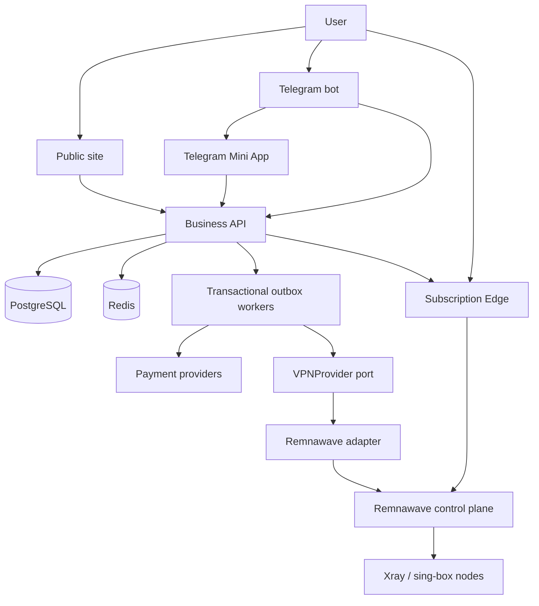
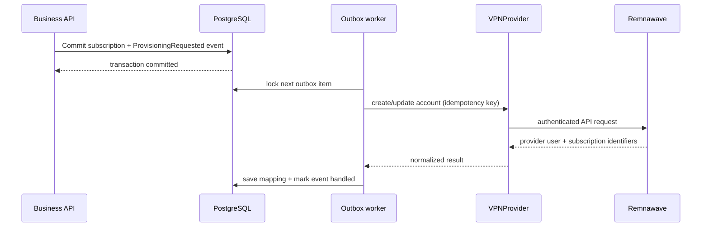
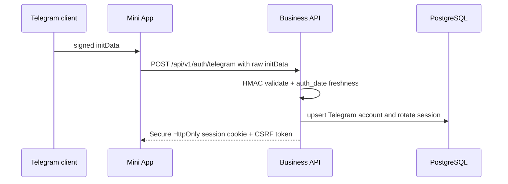
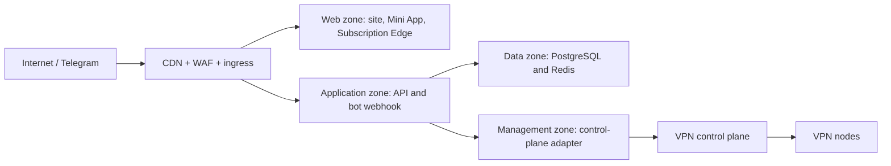

# Architecture

## System overview



## Bounded components

1. **Business platform** is a modular monolith for identity, plans, orders,
   payments, ledger, subscriptions, referrals, promotions, support and audit.
   Transactional boundaries remain local while module APIs prevent direct table
   coupling.
2. **Telegram bot** is a thin worker. It renders menus, opens the Mini App and
   dispatches notifications; it never calculates price or grants entitlement.
3. **Mini App / web account** is one React application with Telegram and browser
   entry points. Backend sessions are authoritative.
4. **VPN provider layer** maps business entitlements to a control plane. The
   initial adapter targets Remnawave. Provider identifiers are stored separately
   from business identifiers.
5. **Subscription Edge** is a later, stateless Go service. It accepts an opaque
   public token, loads an entitlement snapshot, filters healthy groups, renders
   Happ/v2RayTun-compatible content and emits cache-safe metadata.

## Provider provisioning



Provisioning is never performed inside a payment webhook transaction. A provider
outage therefore cannot lose a paid order, and retries cannot duplicate accounts.

## Telegram authentication



The raw `initData` string is validated. Fields from `initDataUnsafe` are display
only. Production rejects development bypasses and stale payloads.

## Payment flow

```mermaid
sequenceDiagram
  participant U as User
  participant API as Business API
  participant PP as Payment provider
  participant DB as PostgreSQL
  U->>API: Create order(plan_id)
  API->>DB: snapshot amount/currency/terms + idempotency key
  API->>PP: create payment with provider idempotency key
  PP-->>U: hosted payment / SBP
  PP->>API: signed webhook
  API->>PP: verify signature and status if required
  API->>DB: lock payment; verify amount/currency/order; ledger + entitlement + outbox
  API-->>PP: 2xx only after durable commit
```

Redirects are informational. The webhook path is replay-safe and all monetary
entries balance to zero across ledger accounts.

## Data rules

- UUIDv7/UUID identifiers are internal; Telegram IDs and provider UUIDs are
  alternate identities with unique constraints.
- Prices use integer minor units and ISO currency. No binary floating point.
- Wallet balance is derived from posted ledger entries; cached balance is only a
  projection.
- Every admin, credential, device, payment and subscription transition writes an
  audit event.
- Public subscription tokens are random, hashed at rest and independently
  rotatable.
- Provider calls use an outbox with idempotency and bounded exponential backoff.

## First-release protocol scope

The client surface is Happ and v2RayTun. Initial node acceptance requires a real
VLESS TCP/RAW Reality path. XHTTP Reality, gRPC Reality, Hysteria2, gaming, LTE and
free service are enabled only after their real end-to-end tests exist; flags do
not claim protocol support before that evidence.

## Deployment trust zones



Data and management services have no public listeners. Node management traffic is
allow-listed and authenticated. Customer traffic and management traffic use
different interfaces/security groups where the provider supports it.
